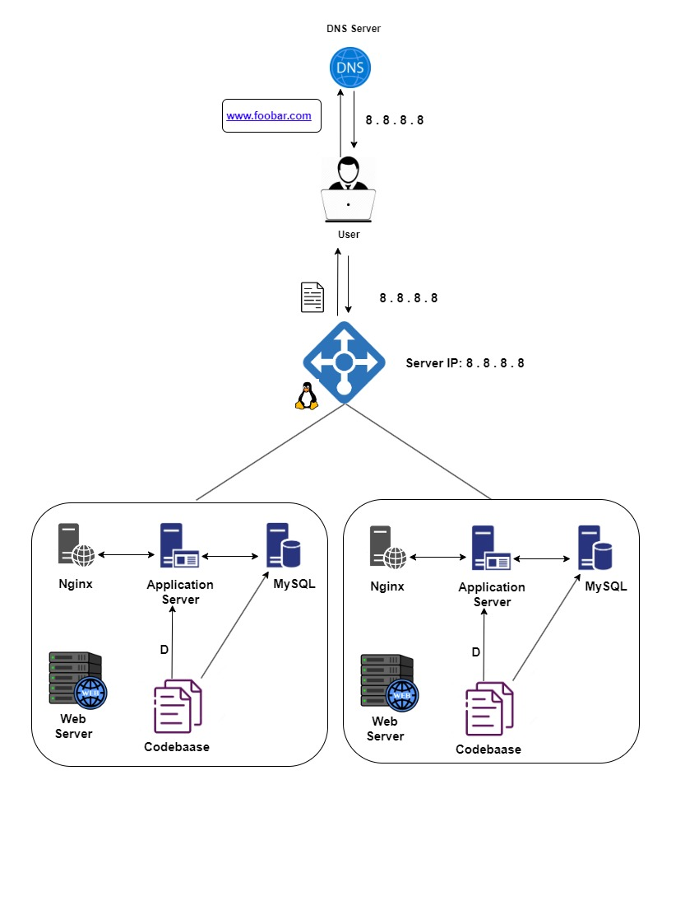

# Distributed web infrastructure

## Description
This infrastructure is designed to distribute web traffic across multiple servers, reducing the load on the primary server. 
It achieves this by utilizing a load balancer that evenly distributes the workload between the primary server and a replica server.

## Specifics About This Infrastructure
1. Additional Elements:
  + Load Balancer: The load balancer is added to distribute incoming traffic across multiple web servers. It helps improve scalability,
    performance, and fault tolerance by evenly distributing the workload. Additionally, it acts as a single entry point for incoming requests, 
    simplifying the architecture and providing high availability.
    
2. Load Balancer Distribution Algorithm:
   + The load balancer is configured with a round-robin distribution algorithm. This algorithm distributes incoming requests evenly across 
     the available web servers in a sequential manner. Each subsequent request is routed to the next server in the rotation. 
     This ensures that each web server receives an equal number of requests, promoting load balancing.
     
3. Active-Active vs. Active-Passive Setup:
   + The load balancer enables an active-active setup. In an active-active setup, both web servers are actively serving traffic simultaneously.
     The load balancer evenly distributes incoming requests across all active servers. This setup provides higher performance and 
     availability as both servers share the load. If one server fails, the other server can handle all incoming traffic.
   + On the other hand, an active-passive setup involves one server (active) actively serving traffic while the other server (passive) 
     remains idle, acting as a backup. If the active server fails, the passive server takes over and starts serving traffic. 
     This setup provides high availability but doesn't fully utilize the resources of the passive server unless a failover occurs.
     
4. Database Primary-Replica (Master-Slave) Cluster:
   + In a Primary-Replica (Master-Slave) cluster, the primary node receives write requests and replicates the data to the replica node(s). 
     The replica node(s) receive read requests and can also be promoted to the primary node if the current primary node fails.
     
5. Difference between Primary Node and Replica Node:
   + The primary node is responsible for handling all write requests and replicating the data to the replica node(s). 
     The replica node(s) are responsible for handling read requests and can be promoted to the primary node if the current primary node fails.
     
     
## This infrastructure design has several issues that need to be addressed:
+ Single point of failure (SPOF):
  The infrastructure has a single point of failure in the load balancer. If the load balancer fails, incoming traffic will not 
  be distributed evenly across the application servers, causing a potential outage. To address this, we should consider adding 
  a backup load balancer or implementing a high availability solution for the load balancer.
+ Security issues:
  The infrastructure does not have a firewall, leaving the servers vulnerable to attacks. Additionally, 
  the website is not using HTTPS, which means that data is transmitted in plain text, leaving it vulnerable to interception and tampering. 
  To address these issues, we should implement a firewall and enable HTTPS for the website.
+ No Monitoring:
  The infrastructure does not have any monitoring in place, which means that we will not be alerted to any performance 
  issues or potential outages. To address this, we should consider implementing a monitoring solution that can alert us to 
  any issues and allow us to take proactive measures to prevent downtime.
